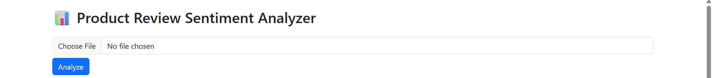
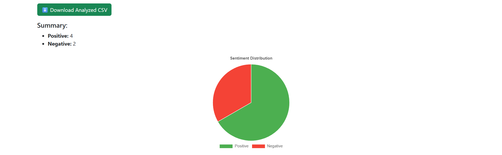
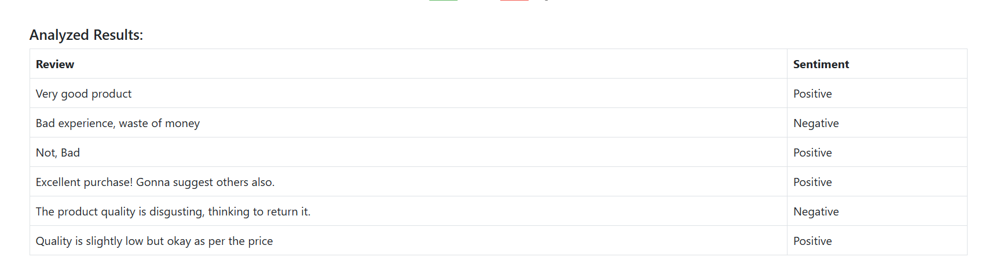

# 📊 Product Review Sentiment Analyzer

A web-based application that analyzes customer review sentiments from uploaded CSV files. Built using **Flask**, **NLTK**, **Pandas**, and **Chart.js**, this project demonstrates the power of **AI in business** by automating customer feedback analysis.

---

## 🚀 Features

- 🔍 Analyzes product reviews using sentiment analysis (Positive, Negative, Neutral)
- 📁 Upload CSV files containing customer reviews
- 📉 Visualizes sentiment distribution using an interactive pie chart
- 📥 Download the analyzed results as a CSV
- 📐 Clean, responsive UI using Bootstrap 5

---

## 🧠 Use Case

This project simulates how businesses can leverage AI to:
- Automate customer feedback classification
- Quickly assess customer satisfaction trends
- Improve decision-making in product strategy and support

---

## 🛠️ Tech Stack

- **Frontend**: HTML, Bootstrap, Chart.js (for pie chart)
- **Backend**: Python, Flask
- **NLP Engine**: NLTK's `SentimentIntensityAnalyzer`
- **Data Handling**: Pandas

---

## 📁 CSV Format

Upload a CSV file with a column named: ID and Reviews


Example:

| Review                            |
|----------------------------------|
| "This product is amazing!"       |
| "Terrible service and quality."  |
| "It’s okay, not great."          |

---

## 📸 Screenshots





---

## 🧪 How It Works

1. **Upload CSV**: User selects a `.csv` file containing product reviews.
2. **Sentiment Analysis**: Each review is analyzed using VADER sentiment scoring.
3. **Result Rendering**:
   - Shows a summary table
   - Renders a pie chart for sentiment distribution
   - Provides a download button to get the results

---

## 📦 Installation & Run

### 1. Clone the Repo

```bash
git clone https://github.com/yourusername/sentiment-analyzer.git
cd sentiment-analyzer


